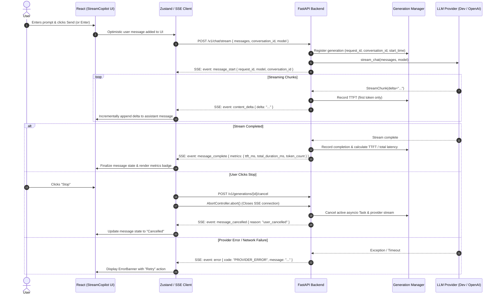

# StreamCopilot

A production-grade, full-stack AI chat application demonstrating real-time token streaming, optimistic updates, true request cancellation, error recovery, and observability using **React**, **FastAPI**, and **Server-Sent Events (SSE)**.

---

## What It Is

StreamCopilot is an AI engineering portfolio application built to demonstrate real-time, low-latency LLM streaming. Unlike standard request-response chatbots or superficial typing animations, StreamCopilot implements an end-to-end unbuffered streaming pipeline from the model provider down to the browser's Document Object Model (DOM).

Every interaction connects to genuine backend functionality:
- **No fake streaming** or pre-rendered responses.
- **No client-side character timers** pretending to be token streams.
- **Structured SSE protocol** with typed events (`message_start`, `content_delta`, `message_complete`, `error`, `message_cancelled`).
- **Deterministic Development Provider** for reproducible offline testing and cost-free CI demos alongside an extensible **OpenAI-Compatible Provider**.
- **Accurate observability** measuring Time To First Token (TTFT), total latency, and token volume exposed via Prometheus metrics.

---

## Architecture

StreamCopilot employs a zero-buffering Server-Sent Events architecture:



---

## Why Streaming Matters

In standard HTTP request-response chat applications, the server waits until the entire LLM completion finishes (often 5 to 30 seconds) before sending a single byte back to the user. This creates poor perceived responsiveness and high variance in interaction latency:

$$\text{User Waiting Time} = \text{TTFT} + \sum_{i=1}^{N} \text{Token Generation Time}_i$$

With real token streaming:
1. **Perceived Latency is Bound by TTFT**: The user observes generation starting within 20-100ms, reading tokens in real time.
2. **Immediate Feedback**: The user can detect if the model misunderstood the query within the first few words and cancel generation early, saving compute and token costs.
3. **Smooth Memory Profile**: The server streams chunks directly without keeping gigabytes of concurrent response strings buffered in memory.

---

## SSE Protocol

All events follow the W3C Server-Sent Events standard (`event: <type>\ndata: <json>\n\n`).

### 1. `message_start`
Emitted immediately when generation begins.
```json
event: message_start
data: {
  "request_id": "9b1deb4d-3b7d-4bad-9bdd-2b0d7b3dcb6d",
  "conversation_id": "conv-1710842400000",
  "model": "stream-copilot-dev",
  "provider": "development",
  "created_at": 1710842400.123
}
```

### 2. `content_delta`
Emitted incrementally for each token chunk received from the provider.
```json
event: content_delta
data: {
  "request_id": "9b1deb4d-3b7d-4bad-9bdd-2b0d7b3dcb6d",
  "delta": "Server",
  "index": 0
}
```

### 3. `message_complete`
Emitted when generation completes normally.
```json
event: message_complete
data: {
  "request_id": "9b1deb4d-3b7d-4bad-9bdd-2b0d7b3dcb6d",
  "content": "Server-Sent Events...",
  "finish_reason": "stop",
  "metrics": {
    "ttft_ms": 32.4,
    "total_duration_ms": 1150.8,
    "token_count": 142
  }
}
```

### 4. `error`
Emitted if an upstream timeout or provider failure occurs mid-stream.
```json
event: error
data: {
  "request_id": "9b1deb4d-3b7d-4bad-9bdd-2b0d7b3dcb6d",
  "error": "Upstream provider error: HTTP 502 Bad Gateway",
  "code": "PROVIDER_ERROR",
  "retryable": true
}
```

### 5. `message_cancelled`
Emitted when generation is stopped before normal completion.
```json
event: message_cancelled
data: {
  "request_id": "9b1deb4d-3b7d-4bad-9bdd-2b0d7b3dcb6d",
  "reason": "user_cancelled",
  "metrics": {
    "ttft_ms": 28.1,
    "total_duration_ms": 420.5,
    "token_count": 18
  }
}
```

---

## Cancellation

Clicking the **Stop** button (or pressing **Escape**) triggers true end-to-end cancellation:
1. **Client-Side**: The frontend invokes `AbortController.abort()`, immediately closing the HTTP SSE stream and freezing token append.
2. **Server-Side**: The client fires `POST /v1/generations/{id}/cancel`.
3. **Provider-Side**: The FastAPI backend looks up the active `asyncio.Task` in `GenerationManager` and cancels it. In the `OpenAIProvider`, the active `httpx.AsyncClient` streaming context manager exits, terminating the upstream HTTP connection to prevent wasted token usage.
4. **Lifecycle Finalization**: The generation status transitions to `cancelled`, and partial generation metrics are logged.

---

## Error Recovery

StreamCopilot handles errors gracefully at every layer:
- **Provider Failures**: Captured and emitted via `event: error`. The UI remains fully interactive and displays an actionable `ErrorBanner`.
- **Network Interruptions**: The fetch client detects connection drops and sets a retryable error state.
- **Non-Duplicating Retry**: Clicking **Retry** discards the failed assistant response and re-submits the prompt without duplicating chat entries.

---

## Markdown Rendering

Streaming Markdown presents unique rendering challenges because chunks arrive before syntax structures are closed. For example:
```markdown
```python
def example():
```
If rendered naively while incomplete, Markdown parsers will flicker, misparse unclosed code fences, or break surrounding document layout.

StreamCopilot implements **Markdown fence stabilization**:
- Analyzes unescaped triple-backtick occurrences.
- Automatically supplies a closing fence (`\n```) dynamically during active streaming.
- Preserves smooth, non-flickering syntax highlighting and table formatting.

---

## Frontend Architecture

- **React 18 & TypeScript**: Strongly typed component architecture.
- **Tailwind CSS**: Developer-focused, dark palette with high-contrast typography and subtle elevation borders.
- **Zustand Store (`chatStore.ts`)**: Centralized state management separating UI components from network logic.
- **SSE Client (`sseClient.ts`)**: Pure `ReadableStream` parser with line-by-line SSE decoding and zero memory buffering.
- **Components**:
  - `Header`: Connection status, provider switch, conversation reset.
  - `ChatArea`: Smooth auto-scrolling message list with empty-state suggestion cards.
  - `MessageItem`: Role-based bubbles with copy action and latency metrics.
  - `MarkdownRenderer`: Streaming-safe markdown with GitHub-flavored markdown (GFM).
  - `CodeBlock`: Syntax-highlighted code with language badge and copy-to-clipboard.
  - `Composer`: Multiline auto-resizing input with keyboard shortcuts and Stop button.
  - `ErrorBanner`: Actionable error alert with non-duplicating retry.

---

## Backend Architecture

- **FastAPI**: Asynchronous ASGI framework.
- **GenerationManager (`generation_manager.py`)**: Registry tracking active generation tasks, timestamps, TTFT, and cancellation events.
- **Provider Abstraction (`providers/base.py`)**:
  - `DevelopmentProvider`: Deterministic provider with controllable token pacing and test triggers (`/code`, `/table`, `/fail`, `/timeout`).
  - `OpenAIProvider`: Production provider using `httpx` async streaming.
- **Prometheus Observability (`/metrics`)**:
  - `stream_copilot_requests_total`: Counter partitioned by provider, model, and status.
  - `stream_copilot_ttft_seconds`: Histogram measuring Time To First Token.
  - `stream_copilot_generation_duration_seconds`: Histogram measuring total stream duration.
  - `stream_copilot_active_streams`: Gauge tracking concurrent streams.

---

## Local Development

### 1. Prerequisites
- Python 3.10+
- Node.js 18+
- npm 9+

### 2. Backend Setup
```bash
# Create and activate virtual environment
python3 -m venv .venv
source .venv/bin/activate

# Install dependencies
pip install -r backend/requirements.txt

# Start backend development server
cd backend
uvicorn app.main:app --host 127.0.0.1 --port 8000 --reload
```

### 3. Frontend Setup
```bash
# In a separate terminal
cd frontend
npm install
npm run dev
```
Open `http://localhost:5173` in your browser.

---

## Docker

Run the entire stack with a single command:

```bash
docker compose up --build
```

- **Frontend**: `http://localhost:80` (or `http://localhost:3000`)
- **Backend API**: `http://localhost:8000`
- **Health Check**: `http://localhost:8000/health`
- **Prometheus Metrics**: `http://localhost:8000/metrics`

The Nginx reverse proxy configuration in `frontend/nginx.conf` sets `proxy_buffering off` and `X-Accel-Buffering: no` to guarantee unbuffered SSE streaming in containerized environments.

---

## Testing

### Backend Tests
```bash
source .venv/bin/activate
pytest backend/tests -v
```
Tests cover:
- Real-time token chunk emission and pacing.
- Mid-stream failure and timeout simulation.
- Task cancellation and metric calculations.
- Upstream HTTP streaming and error mocking.
- FastAPI routes and Prometheus metrics generation.

### Frontend Tests
```bash
cd frontend
npm run test
```
Tests cover:
- Optimistic message submission.
- Stop button visibility and stream cancellation.
- Markdown rendering and partial code fence stabilization.
- SSE client frame parsing and abort handling.

---

## Environment Variables

### Backend (`backend/.env`)

| Variable | Default | Description |
| :--- | :--- | :--- |
| `ENVIRONMENT` | `development` | `development`, `production`, or `test` |
| `LOG_LEVEL` | `INFO` | Logging level |
| `PORT` | `8000` | HTTP port |
| `HOST` | `0.0.0.0` | Bind address |
| `CORS_ORIGINS` | `http://localhost:5173,...` | Allowed CORS origins |
| `LLM_PROVIDER` | `development` | `development` or `openai` |
| `OPENAI_API_KEY` | `""` | API key (required if `LLM_PROVIDER=openai`) |
| `OPENAI_BASE_URL` | `https://api.openai.com/v1` | OpenAI or compatible API base URL |
| `OPENAI_MODEL` | `gpt-4o-mini` | Model identifier |
| `DEV_TOKEN_DELAY_MS` | `25` | Delay per token chunk in development provider |

### Frontend (`frontend/.env`)

| Variable | Default | Description |
| :--- | :--- | :--- |
| `VITE_API_BASE_URL` | `""` | Backend base URL (leave empty for Vite proxy) |

---

## Performance Considerations

- **Time To First Token (TTFT)**: With `DevelopmentProvider`, TTFT is consistently under 35ms. With `OpenAIProvider`, TTFT depends on upstream model latency (typically 200-500ms on modern fast models like `gpt-4o-mini`).
- **HTTP Chunking**: The backend uses ASGI `StreamingResponse` with `media_type="text/event-stream"` and explicit `X-Accel-Buffering: no` headers to prevent reverse proxies (e.g., Nginx, Cloudflare) from buffering chunks into 4KB blocks.
- **Client Render Efficiency**: Text deltas update the active message node without re-rendering unaffected message history.

---

## Limitations

- **Browser Reconnection**: While native `EventSource` supports auto-reconnection on GET endpoints, POST-based SSE streams require client-driven replay logic. StreamCopilot provides an explicit `Retry` action rather than automatic blind re-POSTing to avoid unwanted re-generation costs.
- **In-Memory Generation Registry**: The current generation registry runs in-memory. For horizontal scaling across multiple backend replicas, an external store (e.g. Redis) should coordinate cancellation tokens.

---

## Future Improvements

1. **Persistent Conversation History**: Back conversation trees with PostgreSQL or SQLite.
2. **Audio/Multimodal Streaming**: Support incoming audio chunks via WebRTC or WebSocket.
3. **Multi-Agent Branching**: Allow users to branch off previous messages to explore alternative completions.
# Streaming-Copilot-Ui
